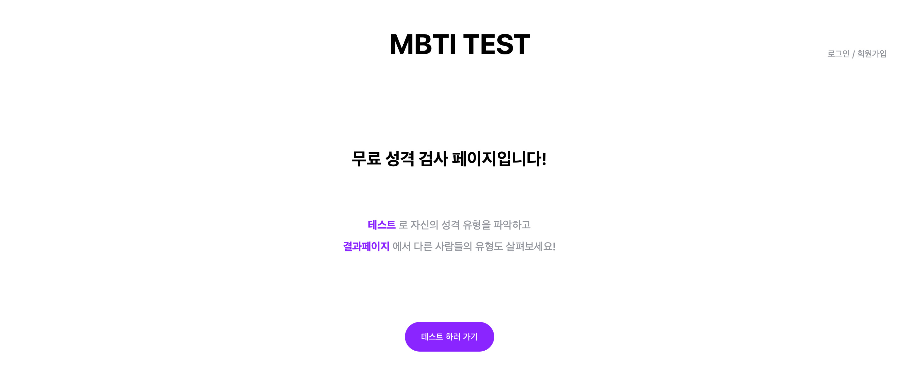
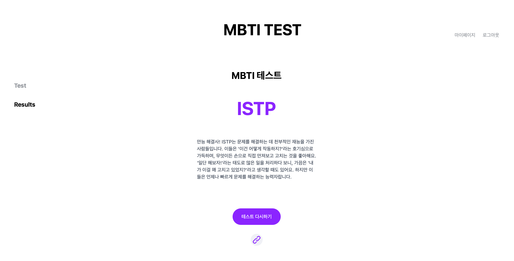
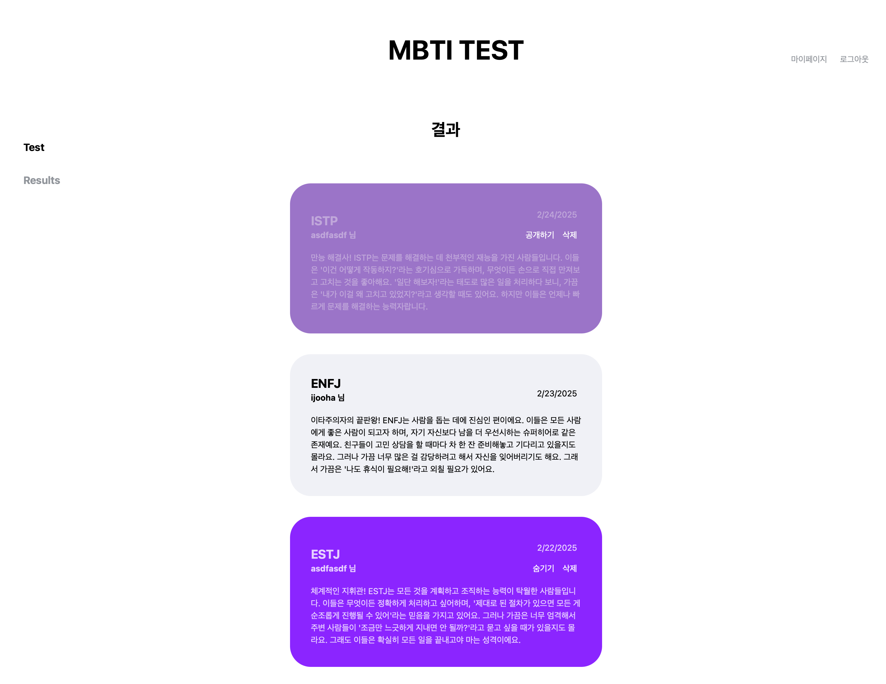
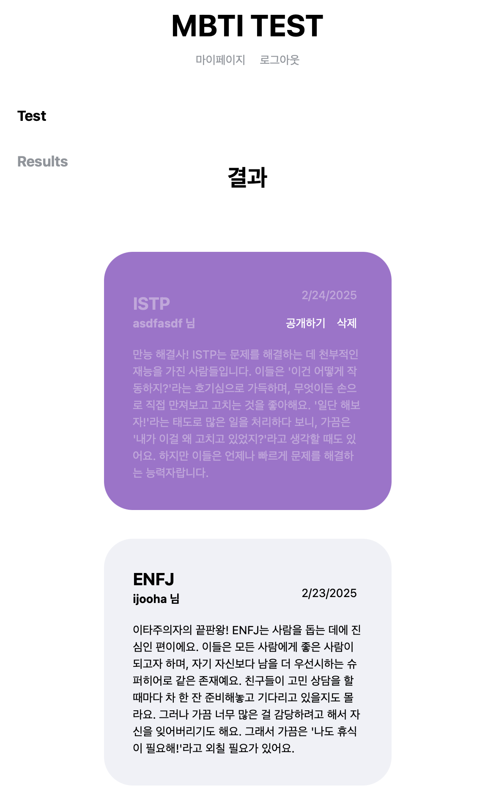

<!-- ####### 헤더 -->

# 🗒️ MBTI TEST : 무료 MBTI 검사 페이지

https://free-mbti-test-juha-yoons-projects.vercel.app/

 

무료 MBTI 검사 사이트입니다.

로그인 하여 테스트 페이지에서 자신의 성격 유형을 파악하고,
결과 페이지에서 다른 사람의 유형도 살펴볼 수 있습니다.

react, tanstack, zustand, axios를 사용했습니다.

 

  
  

 
 
 
 
 

<!-- ####### 프로젝트 소개 -->

<!-- 제목 -->

## 🎤 Project Introduction

 

<!-- 기간 -->

### ✔️ **Development Period**

📅 2025/02/19 ~ 2025/02/24

 
<!-- 테크 스택 -->

### ✔️ **Tech Stack**

 

 
 

react, tanstack, zustand, axios, json-server, tailwind, react-toastify를 사용해 만든 프로젝트입니다.

 
 
 
 
 

<!-- ####### 프로젝트 특징 -->

<!-- 제목 -->

## ✨ Project Features

 

<!-- 특징 하나 -->

### ✔️ **Axios : API 요청**

> - **axios**를 사용해 api를 호출했습니다.
>
> - **jwt 인증**을 적용하여 회원가입과 로그인 기능을 구현 했습니다.
>
> - **json-server**를 사용하여 결과데이터를 업데이트, 수정 및 삭제 가능하게 했습니다.

 

<!-- 특징 하나 -->

### ✔️ **Tanstack : 서버와 로컬 상태 동기화**

> - **useMutation**을 사용하여 회원 관련 정보와 검사 결과가 즉시 반영되도록 했습니다.
>
> - **useQuery**로 항상 최신 상태를 유지하도록 했습니다.

 

<!-- 특징 하나 -->

### ✔️ **Zustand : 전역 상태 관리**

> - **사용자 정보**를 관리하고 API 호출을 줄였습니다.
>
> - **localStorage**에 정보를 전달하여 새로고침 해도 로그인 상태가 유지되도록 했습니다.

 

<!-- 특징 하나 -->

### ✔️ **UXUI**

사용성을 고려한 사용자 위주의 페이지를 구현하고자 했습니다.

> - **반응형 디자인**을 적용하여 모바일, 태블릿, 데스크톱에서 최적화된 UI를 제공하고자 했습니다.
>
> - **사용자 경험**이 고려된 직관적인 UI와 interaction을 구현하고자 했습니다.

  
  

 

 
 
 
 
 

## :paperclip: Tech Blog Address

 

https://ijooha.tistory.com/

 
 
 
 
 

---

### 🌟 Thanks for visiting **Juha's github** ! 🌟

 
 
 
 
 
